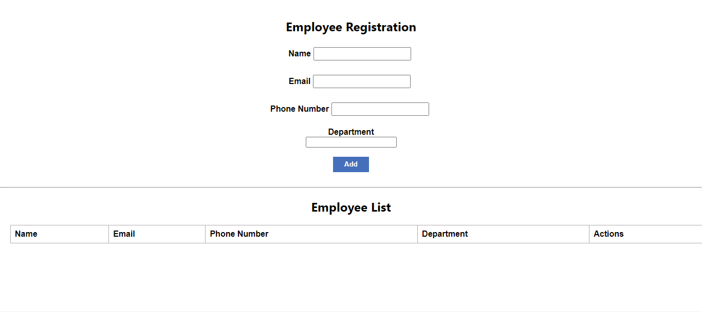
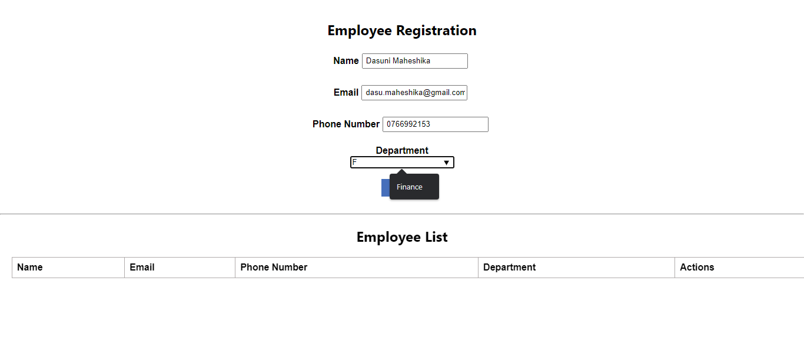
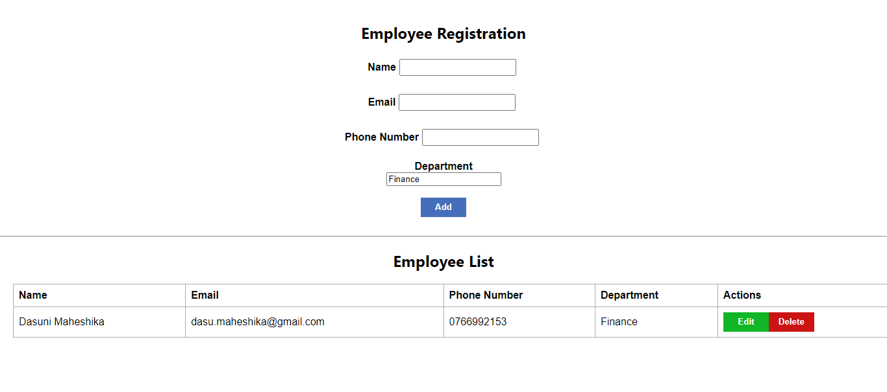

# Employee Registration 

Employee Registration is a simple crud application.

## Build with

- ReactJS
- TypeScript
- CSS

## Features

- User can add new Employees
- User can Edit Existing Employees
- User can Delete Existing Employees

## Sample images

* First interface,

  

* Fill the input field,

  

* After added an employee,

  

